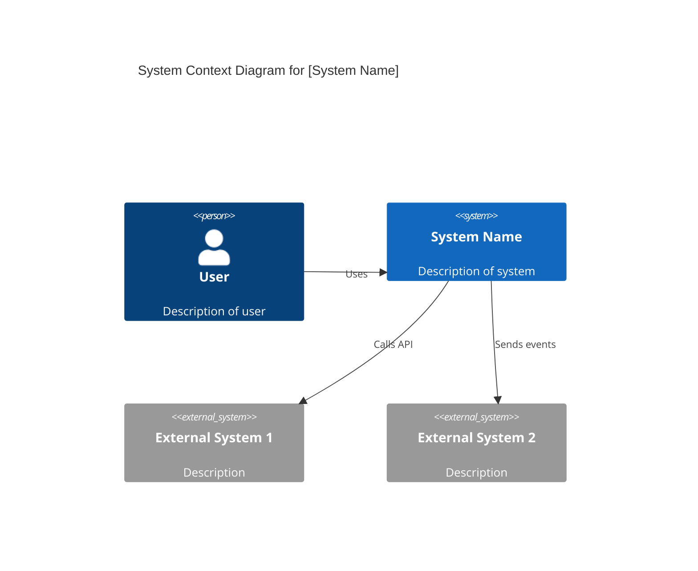
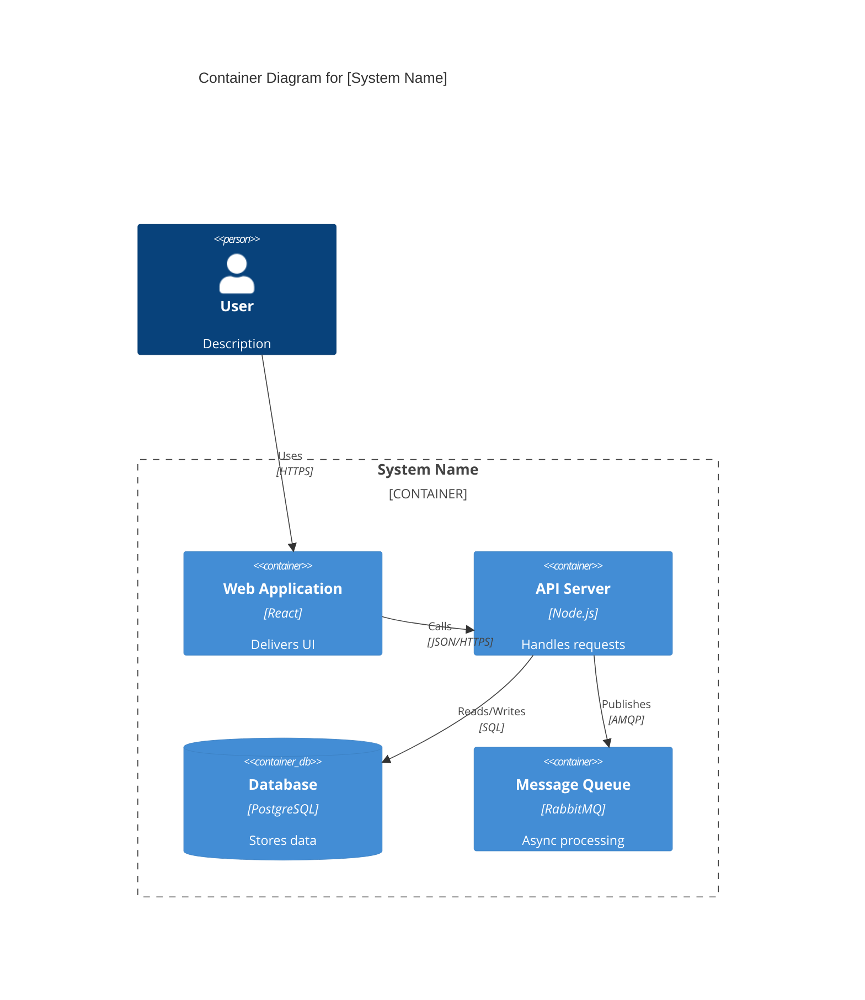
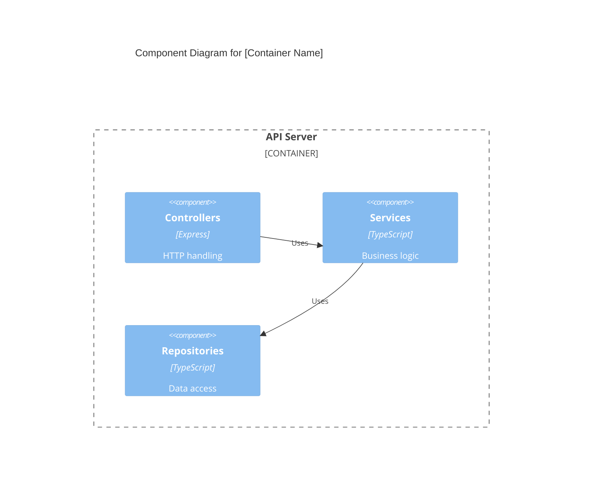

# Architecture Diagrams

Architecture diagrams visualize system structure at appropriate levels of abstraction using C4 model principles (Context, Container, Component, Code).

## When to Use

- Documenting system architecture for new projects
- Communicating technical design to stakeholders
- Onboarding new team members
- Planning architectural changes

## Template

```markdown
# Architecture Diagrams: [System Name]

## Overview

- **System Name**: [Name]
- **Design Document Reference**: [Link]
- **Last Updated**: [Date]
- **Owner**: [Team/Individual]

---

## Context Diagram (Level 1)

Shows how the system fits into the world around it.

### Description
[Brief description of the system boundary and external interactions]

### Diagram



### External Dependencies

| System | Purpose | Integration Type |
|--------|---------|------------------|
| [External System] | [Purpose] | [REST/Events/etc] |

---

## Container Diagram (Level 2)

Shows the high-level shape of the software architecture.

### Description
[Description of major containers and their relationships]

### Diagram



### Container Details

| Container | Technology | Purpose | Scaling |
|-----------|------------|---------|---------|
| [Container] | [Tech] | [Purpose] | [Horizontal/Vertical] |

---

## Component Diagram (Level 3)

Shows internal structure of a specific container.

### Description
[Description of the container being detailed]

### Diagram



### Component Responsibilities

| Component | Responsibility | Key Classes/Modules |
|-----------|---------------|---------------------|
| [Component] | [Responsibility] | [Classes] |

---

## Diagram Legend

| Symbol | Meaning |
|--------|---------|
| [Blue Box] | Internal system/container |
| [Gray Box] | External system |
| [Person] | User/Actor |
| [Cylinder] | Database |
| [Arrow] | Relationship/Data flow |

### Color Coding

| Color | Meaning |
|-------|---------|
| Blue | Internal components |
| Gray | External systems |
| Green | User-facing |
| Orange | Infrastructure |

---

## Notes

### Key Design Decisions
- [Decision 1 and rationale]
- [Decision 2 and rationale]

### Areas of Complexity
- [Complex area and explanation]

### Future Evolution
- [Planned architectural changes]

---

## Related Documentation

- [Technical Design Document](link)
- [ADR Records](link)
- [API Contracts](link)
```

## Quality Criteria

- [ ] Diagrams are current and consistent with implementation
- [ ] Appropriate level of detail for intended audience
- [ ] All external dependencies shown
- [ ] Legend explains all symbols and colors
- [ ] Stored in version control
- [ ] Reviewed by peers
