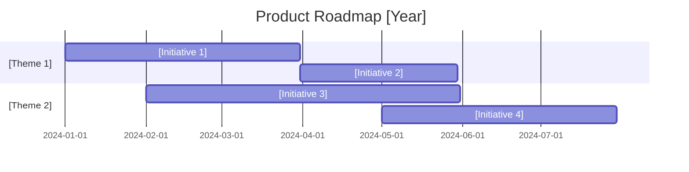

# Product Roadmap

A product roadmap communicates the strategic direction and planned evolution of a product over time, organized by themes, milestones, and time horizons.

## When to Use

- Aligning stakeholders on product direction
- Planning quarterly/annual initiatives
- Communicating priorities to engineering teams
- Tracking progress against strategic goals

## Template

```markdown
# Product Roadmap: [Product Name]

## Overview

- **Product**: [Product Name]
- **Vision Reference**: [Link to Product Vision]
- **Owner**: [Product Manager Name]
- **Last Updated**: [Date]
- **Roadmap Period**: [Q1-Q4 2024 / Next 12 months]

---

## Strategic Context

### Vision Statement
> [One-line product vision statement]

### Annual Theme
> [Theme for this roadmap period]

### Strategic Priorities
1. [Priority 1]
2. [Priority 2]
3. [Priority 3]

---

## Roadmap Overview



---

## Now (Current Quarter)

### Theme: [Current Theme Name]

| Initiative | Description | Status | Epic Link |
|------------|-------------|--------|-----------|
| [Initiative 1] | [Brief description] | 🟢 On Track | [Link] |
| [Initiative 2] | [Brief description] | 🟡 At Risk | [Link] |
| [Initiative 3] | [Brief description] | 🔵 In Progress | [Link] |

### Key Milestones

| Milestone | Target Date | Owner | Status |
|-----------|-------------|-------|--------|
| [Milestone 1] | [Date] | [Name] | ✅ Complete |
| [Milestone 2] | [Date] | [Name] | 🟡 In Progress |
| [Milestone 3] | [Date] | [Name] | ⬜ Not Started |

---

## Next (Next Quarter)

### Theme: [Next Quarter Theme]

| Initiative | Description | Dependencies | Effort |
|------------|-------------|--------------|--------|
| [Initiative 1] | [Description] | [Dependencies] | [S/M/L/XL] |
| [Initiative 2] | [Description] | [Dependencies] | [S/M/L/XL] |
| [Initiative 3] | [Description] | [Dependencies] | [S/M/L/XL] |

### Prerequisites
- [ ] [Prerequisite 1]
- [ ] [Prerequisite 2]

---

## Later (6+ Months)

### Theme: [Future Theme]

| Initiative | Description | Confidence | Rationale |
|------------|-------------|------------|-----------|
| [Initiative 1] | [Description] | High/Medium/Low | [Why it's planned] |
| [Initiative 2] | [Description] | High/Medium/Low | [Why it's planned] |

*Note: Initiatives in this section are subject to change based on learning and market conditions.*

---

## Dependencies

### External Dependencies

| Dependency | Owner | Impact | Mitigation |
|------------|-------|--------|------------|
| [Dependency 1] | [Team/Vendor] | [What it blocks] | [Mitigation plan] |
| [Dependency 2] | [Team/Vendor] | [What it blocks] | [Mitigation plan] |

### Cross-Team Dependencies

| Initiative | Depends On | Team | Status |
|------------|------------|------|--------|
| [Initiative] | [What it needs] | [Team] | 🟢 Committed |
| [Initiative] | [What it needs] | [Team] | 🟡 Tentative |

---

## Risks

| Risk | Probability | Impact | Mitigation |
|------|-------------|--------|------------|
| [Risk 1] | High/Med/Low | High/Med/Low | [Mitigation] |
| [Risk 2] | High/Med/Low | High/Med/Low | [Mitigation] |

---

## Success Metrics

| Metric | Current | Q1 Target | Q2 Target | Q4 Target |
|--------|---------|-----------|-----------|-----------|
| [Metric 1] | [Value] | [Target] | [Target] | [Target] |
| [Metric 2] | [Value] | [Target] | [Target] | [Target] |
| [Metric 3] | [Value] | [Target] | [Target] | [Target] |

---

## Backlog (Unprioritized)

| Idea | Source | Value | Effort | Notes |
|------|--------|-------|--------|-------|
| [Idea 1] | [Customer/Team] | High/Med/Low | [Estimate] | [Notes] |
| [Idea 2] | [Customer/Team] | High/Med/Low | [Estimate] | [Notes] |

---

## Change Log

| Date | Change | Reason |
|------|--------|--------|
| [Date] | [What changed] | [Why] |

---

## Related Documentation

- [Product Vision](link)
- [Strategy Document](link)
- [Epic Documentation](link)
```

## Quality Criteria

- [ ] Aligned with product vision and strategy
- [ ] Clear themes and initiatives per time horizon
- [ ] Dependencies identified and managed
- [ ] Risks documented with mitigations
- [ ] Success metrics defined
- [ ] Reviewed with stakeholders
- [ ] Updated regularly (at least quarterly)
