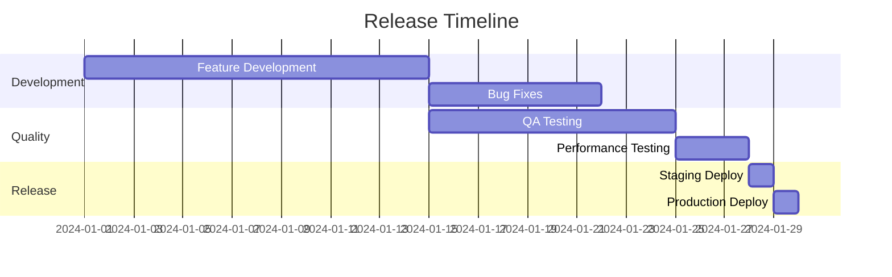

# Release Plan

A release plan documents the scope, schedule, quality gates, rollout strategy, and risk mitigation for a specific release.

## When to Use

- Planning a production release
- Coordinating cross-team release activities
- Establishing quality gates and go/no-go criteria
- Communicating release timeline to stakeholders

## Template

```markdown
# Release Plan: [Release Name/Version]

## Overview

- **Release Name/Version**: [Name]
- **Target Date**: [Date]
- **Release Type**: [Major / Minor / Patch / Hotfix]
- **Release Manager**: [Name]
- **Status**: [Planning / Ready / In Progress / Complete]

---

## Release Scope

### Features Included

| Feature | Epic Link | Status | Owner |
|---------|-----------|--------|-------|
| [Feature 1] | [Link] | ✅ Complete | [Name] |
| [Feature 2] | [Link] | 🟡 In Progress | [Name] |
| [Feature 3] | [Link] | ⬜ Not Started | [Name] |

### Bug Fixes Included

| Issue | Priority | Status | Owner |
|-------|----------|--------|-------|
| [Issue 1] | P1 | ✅ Complete | [Name] |
| [Issue 2] | P2 | 🟡 In Progress | [Name] |

### Explicitly Excluded

| Item | Reason | Target Release |
|------|--------|----------------|
| [Item 1] | [Reason] | [Future version] |

---

## Schedule

| Milestone | Date | Owner | Status |
|-----------|------|-------|--------|
| Feature freeze | [Date] | [Name] | ⬜ |
| Code freeze | [Date] | [Name] | ⬜ |
| QA sign-off | [Date] | [Name] | ⬜ |
| Staging deployment | [Date] | [Name] | ⬜ |
| Production deployment | [Date] | [Name] | ⬜ |
| Post-release verification | [Date] | [Name] | ⬜ |

### Timeline



---

## Quality Gates

### Pre-Release Checklist

| Gate | Criteria | Status | Owner |
|------|----------|--------|-------|
| All tests passing | 100% pass rate | ⬜ | [QA] |
| Code review complete | All PRs approved | ⬜ | [Dev] |
| Security scan | No critical/high findings | ⬜ | [Security] |
| Performance baseline | Meets SLOs | ⬜ | [QA] |
| Documentation updated | Docs reviewed | ⬜ | [Docs] |
| Release notes ready | Approved | ⬜ | [PM] |

### Test Status

| Test Type | Pass | Fail | Skip | Total |
|-----------|------|------|------|-------|
| Unit | [#] | [#] | [#] | [#] |
| Integration | [#] | [#] | [#] | [#] |
| E2E | [#] | [#] | [#] | [#] |
| Performance | [#] | [#] | [#] | [#] |

### Go/No-Go Criteria

| Criterion | Required | Current Status |
|-----------|----------|----------------|
| All P1/P2 bugs fixed | Yes | [Status] |
| Test pass rate > 99% | Yes | [Status] |
| No known critical issues | Yes | [Status] |
| Rollback tested | Yes | [Status] |
| Stakeholder approval | Yes | [Status] |

---

## Rollout Strategy

### Deployment Approach

| Phase | Target | Percentage | Duration | Criteria to Proceed |
|-------|--------|------------|----------|---------------------|
| Canary | [Environment] | 5% | 1 hour | No errors > 0.1% |
| Slow rollout | [Environment] | 25% | 4 hours | Error rate stable |
| Full rollout | [Environment] | 100% | - | All metrics green |

### Deployment Steps

1. **Pre-deployment**
   - [ ] Notify on-call team
   - [ ] Verify all quality gates passed
   - [ ] Confirm rollback plan ready

2. **Deployment**
   - [ ] Deploy to canary
   - [ ] Monitor metrics for [duration]
   - [ ] Proceed or rollback

3. **Post-deployment**
   - [ ] Verify smoke tests pass
   - [ ] Monitor error rates
   - [ ] Confirm feature flags

### Rollback Plan

| Trigger | Action | Owner |
|---------|--------|-------|
| Error rate > 5% | Automatic rollback | [DevOps] |
| P1 bug discovered | Manual rollback decision | [Release Manager] |
| Database issue | Restore from backup | [DBA] |

**Rollback command**: `[command or link to runbook]`

---

## Risks

| Risk | Probability | Impact | Mitigation | Owner |
|------|-------------|--------|------------|-------|
| [Risk 1] | High/Med/Low | High/Med/Low | [Mitigation] | [Name] |
| [Risk 2] | High/Med/Low | High/Med/Low | [Mitigation] | [Name] |
| [Risk 3] | High/Med/Low | High/Med/Low | [Mitigation] | [Name] |

---

## Dependencies

### External Dependencies

| Dependency | Status | Contact | Risk if Delayed |
|------------|--------|---------|-----------------|
| [Dependency 1] | Ready/Pending | [Name] | [Risk] |

### Internal Dependencies

| Dependency | Team | Status |
|------------|------|--------|
| [Dependency 1] | [Team] | Ready/Pending |

---

## Communication Plan

### Pre-Release

| Audience | Channel | Message | When | Owner |
|----------|---------|---------|------|-------|
| Engineering | Slack | Release freeze reminder | T-7 days | [Name] |
| Stakeholders | Email | Release preview | T-5 days | [Name] |
| Support | Meeting | Training on new features | T-3 days | [Name] |

### Release Day

| Event | Channel | Message | Owner |
|-------|---------|---------|-------|
| Deployment start | Slack | "Starting deployment..." | [Name] |
| Deployment complete | Slack + Email | "Release complete..." | [Name] |
| Issues detected | Slack (urgent) | "Issue detected..." | [Name] |

### Post-Release

| Audience | Channel | Message | When |
|----------|---------|---------|------|
| All users | In-app | What's new | Immediate |
| Customers | Email | Release announcement | T+1 day |

---

## Team Contacts

| Role | Name | Contact |
|------|------|---------|
| Release Manager | [Name] | [Slack/Phone] |
| Tech Lead | [Name] | [Slack/Phone] |
| QA Lead | [Name] | [Slack/Phone] |
| DevOps | [Name] | [Slack/Phone] |
| On-Call | [Rotation] | [PagerDuty] |

---

## Related Documentation

- [Release Notes](link)
- [Runbook](link)
- [Monitoring Dashboard](link)
```

## Quality Criteria

- [ ] Scope clearly defined with explicit inclusions/exclusions
- [ ] All quality gates documented
- [ ] Rollout strategy with rollback plan
- [ ] Risks identified with mitigations
- [ ] Communication plan for all stakeholders
- [ ] Team contacts listed
- [ ] Reviewed and approved by stakeholders
