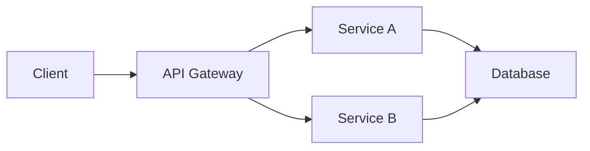
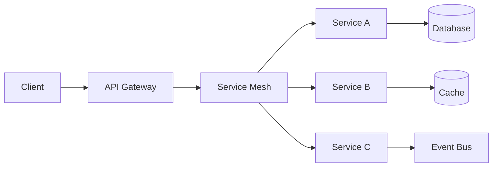

# Vision and Strategy Document

A technical vision and strategy document aligns architecture decisions with product vision, addressing scalability, technical debt, and long-term evolution.

## When to Use

- Aligning technical direction with product vision
- Planning architectural evolution
- Documenting technical debt strategy
- Communicating technical priorities to stakeholders

## Template

```markdown
# Technical Vision & Strategy: [System/Product Name]

## Overview

- **System/Product**: [Name]
- **Product Vision Reference**: [Link]
- **Tech Lead**: [Name]
- **Last Updated**: [Date]
- **Status**: [Draft / In Review / Approved]

---

## Executive Summary

[One paragraph summarizing the technical vision, key strategic priorities, and alignment with product goals]

---

## Product-Technology Alignment

### Product Vision
> [Product vision statement from Product Vision document]

### Technical Vision
> [Technical vision statement that enables the product vision]

*Example: "Build a scalable, resilient platform that enables rapid feature delivery while maintaining 99.9% availability and sub-100ms response times."*

### Alignment Matrix

| Product Goal | Technical Enabler | Current State | Target State |
|--------------|-------------------|---------------|--------------|
| [Goal 1] | [Technical capability] | [Current] | [Target] |
| [Goal 2] | [Technical capability] | [Current] | [Target] |
| [Goal 3] | [Technical capability] | [Current] | [Target] |

---

## Current State Analysis

### Architecture Overview

[High-level description of current architecture]



### Strengths

| Strength | Impact | Preserve |
|----------|--------|----------|
| [Strength 1] | [How it helps] | ✅ Yes |
| [Strength 2] | [How it helps] | ✅ Yes |

### Challenges

| Challenge | Impact | Priority |
|-----------|--------|----------|
| [Challenge 1] | [Business impact] | High |
| [Challenge 2] | [Business impact] | Medium |
| [Challenge 3] | [Business impact] | Low |

### Technical Debt Inventory

| Debt Item | Type | Impact | Effort | Priority |
|-----------|------|--------|--------|----------|
| [Debt 1] | Code/Architecture/Infrastructure | High/Med/Low | S/M/L/XL | P1 |
| [Debt 2] | Code/Architecture/Infrastructure | High/Med/Low | S/M/L/XL | P2 |
| [Debt 3] | Code/Architecture/Infrastructure | High/Med/Low | S/M/L/XL | P3 |

---

## Strategic Pillars

### Pillar 1: [Pillar Name] (e.g., Scalability)

**Goal**: [What we're trying to achieve]

**Current State**: [Where we are now]

**Target State**: [Where we want to be]

**Key Initiatives**:
1. [Initiative 1]
2. [Initiative 2]
3. [Initiative 3]

**Success Metrics**:
| Metric | Current | Target | Timeline |
|--------|---------|--------|----------|
| [Metric 1] | [Value] | [Value] | [Date] |
| [Metric 2] | [Value] | [Value] | [Date] |

---

### Pillar 2: [Pillar Name] (e.g., Developer Productivity)

**Goal**: [What we're trying to achieve]

**Current State**: [Where we are now]

**Target State**: [Where we want to be]

**Key Initiatives**:
1. [Initiative 1]
2. [Initiative 2]
3. [Initiative 3]

**Success Metrics**:
| Metric | Current | Target | Timeline |
|--------|---------|--------|----------|
| [Metric 1] | [Value] | [Value] | [Date] |
| [Metric 2] | [Value] | [Value] | [Date] |

---

### Pillar 3: [Pillar Name] (e.g., Reliability)

**Goal**: [What we're trying to achieve]

**Current State**: [Where we are now]

**Target State**: [Where we want to be]

**Key Initiatives**:
1. [Initiative 1]
2. [Initiative 2]
3. [Initiative 3]

**Success Metrics**:
| Metric | Current | Target | Timeline |
|--------|---------|--------|----------|
| [Metric 1] | [Value] | [Value] | [Date] |
| [Metric 2] | [Value] | [Value] | [Date] |

---

## Target Architecture

### Future State Overview

[Description of the target architecture]



### Key Architectural Decisions

| Decision | Rationale | Trade-offs | ADR Link |
|----------|-----------|------------|----------|
| [Decision 1] | [Why] | [Trade-offs] | [ADR-001](link) |
| [Decision 2] | [Why] | [Trade-offs] | [ADR-002](link) |

### Technology Choices

| Category | Current | Target | Migration Path |
|----------|---------|--------|----------------|
| Runtime | [Current] | [Target] | [Approach] |
| Database | [Current] | [Target] | [Approach] |
| Messaging | [Current] | [Target] | [Approach] |
| Observability | [Current] | [Target] | [Approach] |

---

## Technical Debt Strategy

### Principles

1. [Principle 1: e.g., "Allocate 20% of capacity to debt reduction"]
2. [Principle 2: e.g., "Address debt blocking feature delivery first"]
3. [Principle 3: e.g., "Refactor incrementally, not big bang"]

### Prioritization Matrix

| Quadrant | Criteria | Action |
|----------|----------|--------|
| High Impact, Low Effort | Quick wins | Do first |
| High Impact, High Effort | Major initiatives | Plan carefully |
| Low Impact, Low Effort | Nice to have | As time permits |
| Low Impact, High Effort | Consider not doing | Avoid or defer |

### Debt Reduction Roadmap

| Quarter | Focus Area | Debt Items | Expected Impact |
|---------|------------|------------|-----------------|
| Q1 | [Focus] | [Items] | [Impact] |
| Q2 | [Focus] | [Items] | [Impact] |
| Q3 | [Focus] | [Items] | [Impact] |
| Q4 | [Focus] | [Items] | [Impact] |

---

## Scalability Roadmap

### Current Limits

| Dimension | Current Limit | Bottleneck | Risk Timeline |
|-----------|---------------|------------|---------------|
| Users | [#] | [What limits] | [When it becomes problem] |
| Requests/sec | [#] | [What limits] | [When it becomes problem] |
| Data volume | [Size] | [What limits] | [When it becomes problem] |

### Scaling Strategy

| Phase | Trigger | Action | Capacity Gain |
|-------|---------|--------|---------------|
| Phase 1 | [Trigger] | [Action] | [Gain] |
| Phase 2 | [Trigger] | [Action] | [Gain] |
| Phase 3 | [Trigger] | [Action] | [Gain] |

---

## Investment Priorities

### Time Allocation

| Category | Current | Target |
|----------|---------|--------|
| New Features | [%] | [%] |
| Technical Debt | [%] | [%] |
| Platform/Infrastructure | [%] | [%] |
| Maintenance/Support | [%] | [%] |

### Resource Needs

| Area | Current | Needed | Gap |
|------|---------|--------|-----|
| [Area 1] | [Current] | [Needed] | [Gap] |
| [Area 2] | [Current] | [Needed] | [Gap] |

---

## Risks & Mitigations

| Risk | Probability | Impact | Mitigation |
|------|-------------|--------|------------|
| [Risk 1] | High/Med/Low | High/Med/Low | [Mitigation] |
| [Risk 2] | High/Med/Low | High/Med/Low | [Mitigation] |
| [Risk 3] | High/Med/Low | High/Med/Low | [Mitigation] |

---

## Success Metrics

### Key Results

| Objective | Key Result | Current | Target | Timeline |
|-----------|------------|---------|--------|----------|
| [Objective 1] | [KR 1] | [Current] | [Target] | [Date] |
| [Objective 1] | [KR 2] | [Current] | [Target] | [Date] |
| [Objective 2] | [KR 3] | [Current] | [Target] | [Date] |

### Review Cadence

- **Monthly**: Progress against key results
- **Quarterly**: Strategy review and adjustment
- **Annually**: Vision refresh

---

## Related Documentation

- [Product Vision](link)
- [Architecture Diagrams](link)
- [ADR Index](link)
- [Technical Roadmap](link)
```

## Quality Criteria

- [ ] Aligned with product vision
- [ ] Current state honestly assessed
- [ ] Strategic pillars are actionable
- [ ] Technical debt prioritized and planned
- [ ] Scalability concerns addressed
- [ ] Success metrics defined
- [ ] Reviewed and approved by leadership
- [ ] Communicated to engineering team
