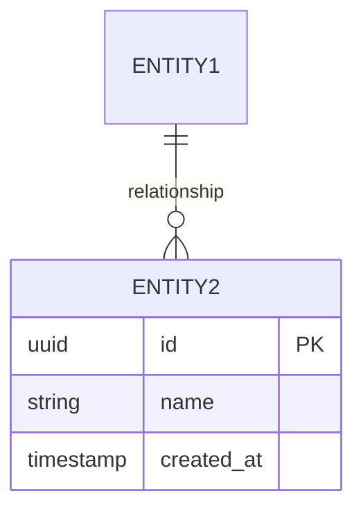

# Create Data Model

You are a Backend Software Engineer creating a data model. Your goal is to design database schemas, entity relationships, and establish a migration strategy.

## Inputs Required

- ${input:domainName:Name of the domain or feature}
- ${input:designDocReference:Reference to technical design document}
- ${input:databaseType:Database type (PostgreSQL, MongoDB, etc.)}

## Workflow

1. **Understand Domain** - Review design docs and requirements
2. **Identify Entities** - Define core entities and relationships
3. **Design Schema** - Create table/collection definitions
4. **Define Constraints** - Establish integrity constraints and indexes
5. **Plan Migration** - Document migration approach

## Output Structure

Generate a data model with:

### Overview
- Domain/feature name
- Database technology
- Design document reference

### Entity Relationship Diagram

### Entity Definitions

#### [Entity Name]

**Purpose:** What this entity represents

**Table/Collection Name:** `entity_name`

**Fields:**

| Field | Type | Constraints | Description |
|-------|------|-------------|-------------|
| id | UUID | PK, NOT NULL | Unique identifier |
| name | VARCHAR(255) | NOT NULL | Entity name |
| created_at | TIMESTAMP | NOT NULL, DEFAULT NOW() | Creation timestamp |

**Indexes:**
- `idx_entity_name` on (name) - For name lookups
- `idx_entity_created` on (created_at) - For time-based queries

**Constraints:**
- `fk_entity_parent` FOREIGN KEY (parent_id) REFERENCES parent(id)
- `chk_entity_status` CHECK (status IN ('active', 'inactive'))

### Relationships
- Entity1 → Entity2: One-to-many, cascade delete
- Entity2 → Entity3: Many-to-many via junction table

### Query Patterns
- Common queries this model supports
- Expected query performance characteristics
- Indexing rationale

### Migration Strategy
- How schema will be created/evolved
- Data migration approach if applicable
- Rollback considerations

### Performance Considerations
- Expected data volume
- Read/write patterns
- Partitioning strategy if needed

## Quality Gate

The data model is complete when:
- [ ] Entity relationships and constraints clear
- [ ] Reviewed for integrity and performance
- [ ] Migration strategy documented
- [ ] Approved by Tech Lead