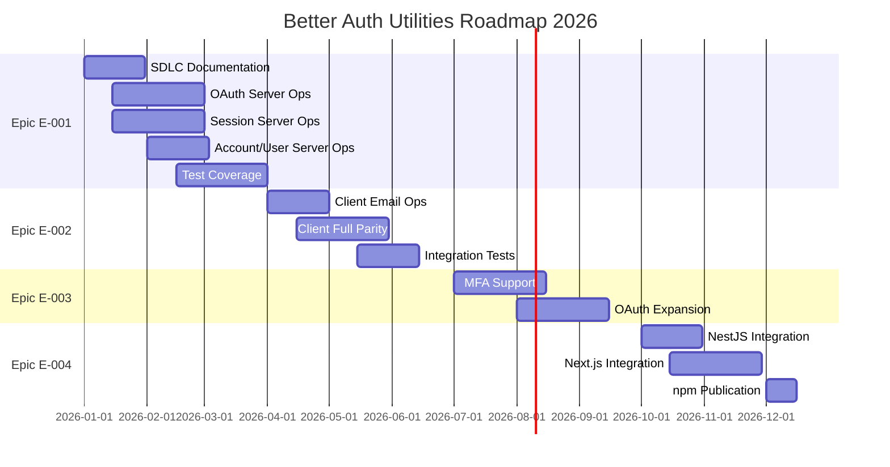

# Product Roadmap: Better Auth Utilities

## Overview

- **Product**: Better Auth Utilities
- **Vision Reference**: [Product Vision](../vision/product-vision.md)
- **Owner**: Product Manager
- **Last Updated**: 2026-01-03
- **Roadmap Period**: Q1-Q4 2026

---

## Strategic Context

### Vision Statement
>
> Empower TypeScript developers using Effect-TS to integrate Better Auth with type-safe patterns, Schema-validated inputs, tagged errors, and dependency injection.

### Annual Theme
>
> Establish Better Auth Utilities as the standard Effect-TS authentication library for the Emperorrag ecosystem.

### Strategic Priorities

1. Complete server-side operation coverage across all domains
2. Achieve production-quality test coverage and documentation
3. Deliver client-side parity for frontend applications
4. Integrate with monorepo consumers (NestJS microservice, Next.js frontend)

---

## Roadmap Overview

---

## Now (Q1 2026)

### Theme: Documentation & Stabilization

Catch up documentation with implementation and complete server-side operation coverage.

| Initiative | Description | Status | Priority |
|------------|-------------|--------|----------|
| F-001 Complete SDLC Documentation | Create all SDLC artefacts (PRD, TDD, test plans) | 🟡 In Progress | P0 |
| F-002 OAuth Server Operations | Add controller/service for sign-in-social, callback, link-social-account | 🔵 Not Started | P0 |
| F-003 Session Server Operations | Add controller/service for get-session, list-sessions, refresh, revoke | 🔵 Not Started | P0 |
| F-004 Account Server Operations | Add controller/service for account-info, list-user-accounts, unlink-account | 🔵 Not Started | P0 |
| F-005 User Server Operations | Add controller/service for update-user, delete-user | 🔵 Not Started | P0 |
| F-006 API Documentation | Ensure all public exports have complete TSDoc comments | 🔵 Not Started | P1 |
| F-007 Unit Test Coverage | Achieve ≥80% test coverage across all modules | 🔵 Not Started | P1 |

### Key Milestones

| Milestone | Target Date | Owner | Status |
|-----------|-------------|-------|--------|
| M-001 SDLC Documentation Complete | 2026-01-31 | Product Manager | 🟡 In Progress |
| M-002 All Server Domains Implemented | 2026-02-28 | Backend Engineer | ⬜ Not Started |
| M-003 Test Coverage Target (≥80%) | 2026-03-15 | Backend Engineer | ⬜ Not Started |
| M-004 Epic E-001 Sign-off | 2026-03-31 | Tech Lead | ⬜ Not Started |

---

## Next (Q2 2026)

### Theme: Client Parity & Testing

Bring client-side utilities to feature parity with server-side and enhance testing infrastructure.

| Initiative | Description | Dependencies | Effort |
|------------|-------------|--------------|--------|
| F-008 Client Email Operations | sign-in, sign-up, sign-out, verification for client | Server ops stable | L |
| F-009 Client Session Operations | get-session, refresh for client | Server ops stable | M |
| F-010 Client Account Operations | link-social, list-accounts, unlink for client | Server ops stable | M |
| F-011 Client User Operations | update-user for client | Server ops stable | S |
| F-012 Integration Test Suite | End-to-end tests against test auth server | Epic E-001 complete | L |
| F-013 Property-Based Testing | Add FastCheck generators for schema testing | Schemas stable | M |

### Prerequisites

- [ ] All server domains implemented (F-002-F-005)
- [ ] Test coverage at ≥80% (F-007)
- [ ] setupServerTestEnvironment validated

---

## Later (Q3-Q4 2026)

### Theme: Advanced Features & Ecosystem Integration

| Initiative | Description | Confidence | Rationale |
|------------|-------------|------------|------------|
| F-014 Multi-Factor Authentication | Support MFA flows with Effect patterns | Medium | Better Auth MFA plugin dependency |
| F-015 OAuth Provider Expansion | Add utilities for additional OAuth providers | High | Community request, straightforward |
| F-016 Session Caching Layer | Optional Effect-based session cache | Low | Architecture decision pending |
| F-017 Audit Logging | Effect-based audit logging for auth events | Medium | Security compliance requirement |
| F-018 NestJS Microservice Integration | Tight integration with `better-auth-nest-js-microservice` | High | Core ecosystem need |
| F-019 Next.js Frontend Integration | Client utilities for `better-auth-next-js-frontend` | High | Core ecosystem need |
| F-020 npm Package Publication | Publish to npm registry | High | Required for external adoption |
| F-021 Migration Guide | Guide for adopting from raw Better Auth | Medium | Developer experience |

*Note: Initiatives in this section are subject to change based on learning and market conditions.*

---

## Dependencies

### External Dependencies

| Dependency | Owner | Impact | Mitigation |
|------------|-------|--------|------------|
| Better Auth SDK | better-auth team | Core functionality | Pin version, monitor releases |
| Effect-TS | Effect team | Type system, runtime | Follow release notes, test upgrades |
| Vitest / @effect/vitest | Vitest team | Testing infrastructure | Already integrated |
| Vite | Vite team | Build system | Already integrated |

### Cross-Team Dependencies

| Initiative | Depends On | Team | Status |
|------------|------------|------|--------|
| F-018 NestJS Integration | Microservice architecture stable | Backend | 🟡 Tentative |
| F-019 Next.js Integration | Frontend architecture finalized | Frontend | 🟡 Tentative |
| F-020 npm Publication | Registry access configured | DevOps | 🔵 Not Started |

---

## Current State (Implemented)

The following capabilities are already implemented as of January 2026:

### Server-Side Operations

#### Email Domain (Implemented)

| Operation | Controller | Service | Types | Tests |
|-----------|------------|---------|-------|-------|
| sign-up-email | ✅ | ✅ | ✅ | 🔵 |
| sign-in-email | ✅ | ✅ | ✅ | 🔵 |
| sign-out-email | ✅ | ✅ | ✅ | 🔵 |
| verify-email | ✅ | ✅ | ✅ | 🔵 |
| send-verification-email | ✅ | ✅ | ✅ | 🔵 |
| change-password | ✅ | ✅ | ✅ | 🔵 |
| reset-password | ✅ | ✅ | ✅ | 🔵 |
| request-password-reset | ✅ | ✅ | ✅ | 🔵 |
| set-password | ✅ | ✅ | ✅ | 🔵 |
| change-email | ✅ | ✅ | ✅ | 🔵 |
| forgot-password | ✅ | ✅ | ✅ | 🔵 |

#### Other Domains (Schemas Only - Controller/Service Pending)

| Domain | Command Schemas | Controller/Service |
|--------|-----------------|--------------------|
| OAuth | sign-in-social, callback-oauth, link-social-account | 🔵 Pending |
| Session | get-session, list-sessions, refresh-token, revoke-session, revoke-sessions, revoke-other-sessions, get-access-token | 🔵 Pending |
| Account | account-info, list-user-accounts, unlink-account | 🔵 Pending |
| User | update-user, delete-user, delete-user-callback | 🔵 Pending |

**Legend:** ✅ Implemented | 🔵 Planned/Pending | ❌ Not Applicable

### Infrastructure

| Component | Status | Notes |
|-----------|--------|-------|
| Tagged Error Classes | ✅ | InputError, ApiError, SessionError, DataMissingError, DependenciesError |
| BetterAuthOptions Schema | ✅ | Full schema with FastCheck arbitraries |
| Config Layer (BetterAuthOptionsLive) | ✅ | Effect Layer for DI |
| Server Layer (AuthServerLive) | ✅ | Constructs Better Auth instance |
| Pipeline Utilities | ✅ | handle-api-error, handle-input-error, map-api-error, map-input-error |
| Command Schemas | ✅ | 29 operation command schemas |
| Field Schemas | ✅ | accounts, emails, images, names, params, passwords, sessions, transport, urls, users, verifications |
| Test Environment | ✅ | setupServerTestEnvironment helper |
| Vite Build | ✅ | Library mode with entry points |
| Code Templates | ✅ | Controller, service, types, spec templates |

### Client-Side Operations

| Component | Status | Notes |
|-----------|--------|-------|
| Client Module | 🔵 Stub | Only test directory and spec file exist |
| Client Operations | 🔵 Pending | No controller/service implementations yet |

---

## Risks & Mitigations

| Risk | Probability | Impact | Mitigation |
|------|-------------|--------|------------|
| Better Auth SDK breaking changes | Medium | High | Pin version, monitor releases, test matrix |
| Effect-TS major version changes | Low | High | Follow @effect/core release notes |
| Test coverage gaps hide bugs | Medium | Medium | Enforce coverage thresholds in CI |
| Documentation drift | Medium | Low | Automate doc generation, review PRs |
| Client/server API divergence | Low | Medium | Shared types, integration tests |

---

## Success Metrics

| Metric | Current | Q1 Target | Q2 Target | Q4 Target |
|--------|---------|-----------|-----------|------------|
| Server Domain Coverage | 1/5 (Email only) | 5/5 | 5/5 | 5/5 |
| Client Domain Coverage | 0/5 | 0/5 | 5/5 | 5/5 |
| Test Coverage | ~20% | ≥80% | ≥85% | ≥90% |
| TSDoc Coverage | ~30% | ≥80% | 100% | 100% |
| Monorepo Consumers | 0 | 0 | 1 | ≥2 |

---

## Backlog (Unprioritized)

| Idea | Source | Value | Effort | Notes |
|------|--------|-------|--------|-------|
| Admin operations (list users, ban user) | Product | Medium | L | May require Better Auth admin plugin |
| Token introspection utilities | Tech Lead | Medium | M | OAuth compliance |
| Session analytics helpers | Product | Low | S | Nice-to-have |
| Custom error serialization | Backend Engineer | Low | S | Framework-specific needs |

---

## Change Log

| Date | Change | Reason |
|------|--------|--------|
| 2026-01-03 | Initial roadmap created | Document existing implementation and plan completion |
| 2026-01-03 | Added F-002-F-005 server domain initiatives | Server coverage incomplete, only Email domain implemented |

---

## Related Documentation

- [Product Vision](../vision/product-vision.md)
- [PRD](../prd/prd-E-001.md) (planned)
- [Technical Design Doc](../design/technical-design-doc-E-001.md) (planned)

---

## Approval

| Role | Name | Date | Status |
|------|------|------|--------|
| Product Manager | | 2026-01-03 | ✅ Approved |
| Tech Lead | | 2026-01-03 | ✅ Approved |
