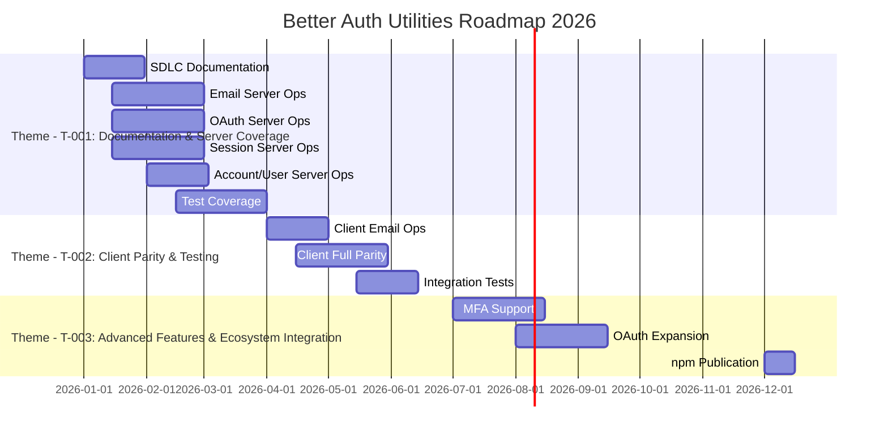

# Product Roadmap: Better Auth Utilities

## Overview

- **Product**: Better Auth Utilities
- **Vision Reference**: [Product Vision](../vision/v0-product-vision.md)
- **Owner**: Product Manager
- **Last Updated**: 2026-01-03
- **Roadmap Period**: Q1-Q4 2026

---

## Strategic Context

### Vision Statement
>
> Empower TypeScript developers using Effect-TS to integrate Better Auth with type-safe patterns, Schema-validated inputs, tagged errors, and dependency injection.

### Annual Theme
>
> Establish Better Auth Utilities as the standard Effect-TS authentication library for the Emperorrag ecosystem.

### Strategic Priorities

1. Complete server-side operation coverage across all domains
2. Achieve production-quality test coverage and documentation
3. Deliver client-side parity for frontend applications
4. Integrate with monorepo consumers

---

## Roadmap Overview

---

## Now (Q1 2026)

### Theme - T-001: Documentation & Server Coverage

Create SDLC documentation and implement server-side operation coverage across all domains.

| Initiative | Description | Status | Priority |
|------------|-------------|--------|----------|
| I-001: Complete SDLC Documentation | Create all SDLC artefacts (PRD, TDD, test plans) | 🔵 Not Started | P0 |
| I-002: Email Server Operations | Implement email operations: sign-up, sign-in, sign-out, verify, password reset/change | 🔵 Not Started | P0 |
| I-003: OAuth Server Operations | Implement OAuth operations: sign-in-social, callback, link-social-account | 🔵 Not Started | P0 |
| I-004: Session Server Operations | Implement session operations: get-session, list-sessions, refresh, revoke | 🔵 Not Started | P0 |
| I-005: Account Server Operations | Implement account operations: account-info, list-user-accounts, unlink-account | 🔵 Not Started | P0 |
| I-006: User Server Operations | Implement user operations: update-user, delete-user | 🔵 Not Started | P0 |
| I-007: API Documentation | Ensure all public exports have complete TSDoc comments | 🔵 Not Started | P1 |
| I-008: Unit Test Coverage | Achieve ≥80% test coverage across all modules | 🔵 Not Started | P1 |

### Key Milestones

| Milestone | Target Date | Owner | Status |
|-----------|-------------|-------|--------|
| M-001: SDLC Documentation Complete | 2026-01-31 | Product Manager | ⬜ Not Started |
| M-002: All Server Domains Complete | 2026-02-28 | Backend Engineer | ⬜ Not Started |
| M-003: Test Coverage Target (≥80%) | 2026-03-15 | Backend Engineer | ⬜ Not Started |
| M-004: Initiative 1 Sign-off | 2026-03-31 | Tech Lead | ⬜ Not Started |

---

## Next (Q2 2026)

### Theme - T-002: Client Parity & Testing

Bring client-side utilities to feature parity with server-side and enhance testing infrastructure.

| Initiative | Description | Dependencies | Effort |
|------------|-------------|--------------|--------|
| I-009: Client Email Operations | sign-in, sign-up, sign-out, verification for client | Server ops stable | L |
| I-010: Client Session Operations | get-session, refresh for client | Server ops stable | M |
| I-011: Client Account Operations | link-social, list-accounts, unlink for client | Server ops stable | M |
| I-012: Client User Operations | update-user for client | Server ops stable | S |
| I-013: Integration Test Suite | End-to-end tests against test auth server | Initiative 1 complete | L |
| I-014: Property-Based Testing | Add property-based testing generators for schema validation | Schemas stable | M |

### Prerequisites

- [ ] All server domains complete (I-002–I-006)
- [ ] Test coverage at ≥80% (I-008)
- [ ] Server test environment helper validated

---

## Later (Q3-Q4 2026)

### Theme - T-003: Advanced Features & Ecosystem Integration

| Initiative | Description | Confidence | Rationale |
|------------|-------------|------------|------------|
| I-015: Multi-Factor Authentication | Support MFA flows with Effect patterns | Medium | Better Auth MFA plugin dependency |
| I-016: OAuth Provider Expansion | Add utilities for additional OAuth providers | High | Community request, straightforward |
| I-017: Session Caching Layer | Optional Effect-based session cache | Low | Architecture decision pending |
| I-018: Audit Logging | Effect-based audit logging for auth events | Medium | Security compliance requirement |
| I-019: npm Package Publication | Publish to npm registry | High | Required for external adoption |
| I-020: Migration Guide | Guide for adopting from raw Better Auth | Medium | Developer experience |

*Note: Initiatives in this section are subject to change based on learning and market conditions.*

---

## Dependencies

### External Dependencies

| Dependency | Owner | Impact | Mitigation |
|------------|-------|--------|------------|
| Better Auth SDK | better-auth team | Core functionality | Pin version, monitor releases |
| Effect-TS | Effect team | Type system, runtime | Follow release notes, test upgrades |
| Vitest / Effect testing extensions | Vitest team | Testing infrastructure | Standard tooling |
| Vite | Vite team | Build system | Standard tooling |

### Cross-Team Dependencies

| Initiative | Depends On | Team | Status |
|------------|------------|------|--------|
| I-019: npm Package Publication | Registry access configured | DevOps | 🔵 Not Started |

---

## Risks & Mitigations

| Risk | Probability | Impact | Mitigation |
|------|-------------|--------|------------|
| Better Auth SDK breaking changes | Medium | High | Pin version, monitor releases, test matrix |
| Effect-TS major version changes | Low | High | Follow Effect-TS release notes |
| Test coverage gaps hide bugs | Medium | Medium | Enforce coverage thresholds in CI |
| Documentation drift | Medium | Low | Automate doc generation, review PRs |
| Client/server API divergence | Low | Medium | Shared types, integration tests |

---

## Success Metrics

| Metric | Current | Q1 Target | Q2 Target | Q4 Target |
|--------|---------|-----------|-----------|------------|
| Server Domain Coverage | 0/5 | 5/5 | 5/5 | 5/5 |
| Client Domain Coverage | 0/5 | 0/5 | 5/5 | 5/5 |
| Test Coverage | 0% | ≥80% | ≥85% | ≥90% |
| TSDoc Coverage | 0% | ≥80% | 100% | 100% |
| Monorepo Consumers | 0 | 0 | 1 | ≥2 |

---

## Backlog (Unprioritized)

| Idea | Source | Value | Effort | Notes |
|------|--------|-------|--------|-------|
| Admin operations (list users, ban user) | Product | Medium | L | May require Better Auth admin plugin |
| Token introspection utilities | Tech Lead | Medium | M | OAuth compliance |
| Session analytics helpers | Product | Low | S | Nice-to-have |
| Custom error serialization | Backend Engineer | Low | S | Framework-specific needs |

---

## Change Log

| Date | Change | Reason |
|------|--------|--------|
| 2026-01-03 | Initial roadmap created | Establish initial product roadmap |
| 2026-01-03 | Added server domain initiatives | Plan server domain coverage across all auth domains |

---

## Related Documentation

- [Product Vision](../vision/v0-product-vision.md)

---

## Approval

| Role | Name | Date | Status |
|------|------|------|--------|
| Product Manager | | 2026-01-03 | ✅ Approved |
| Tech Lead | | 2026-01-03 | ✅ Approved |
