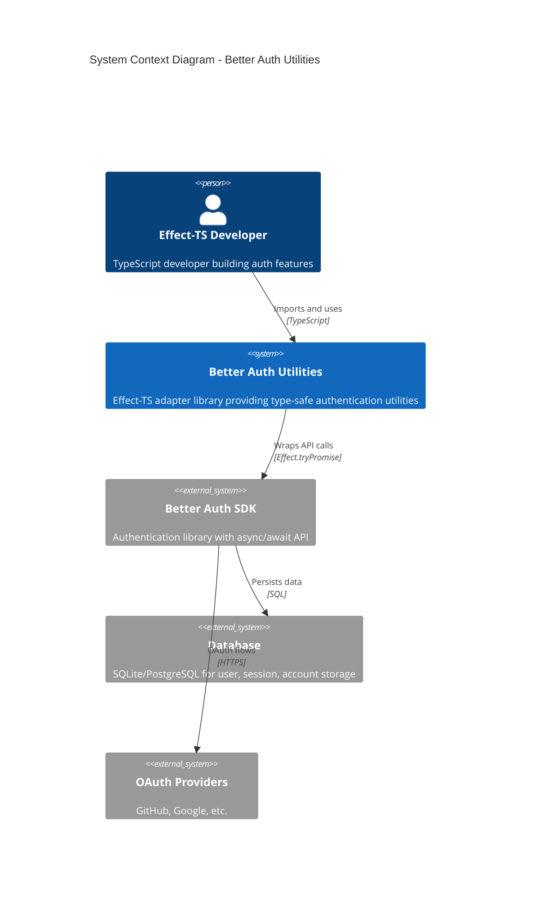
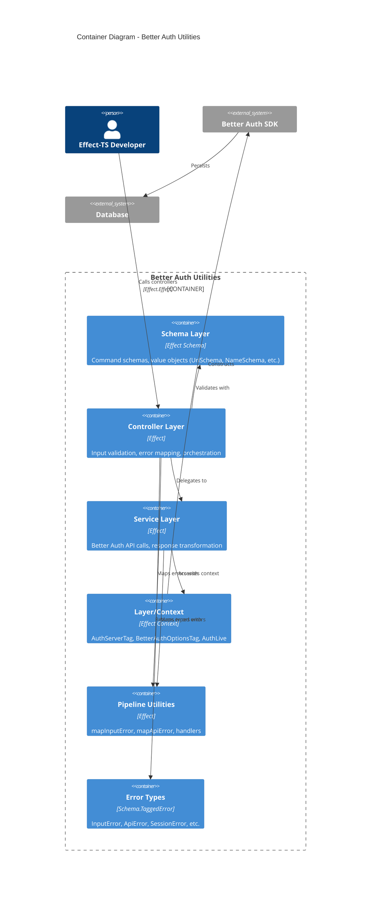
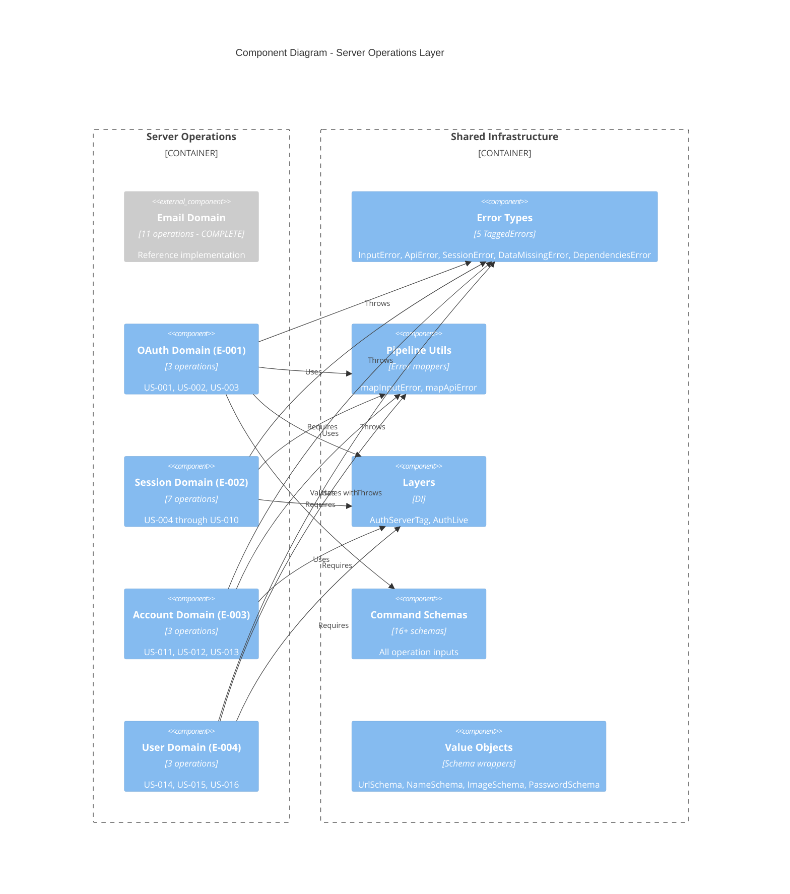
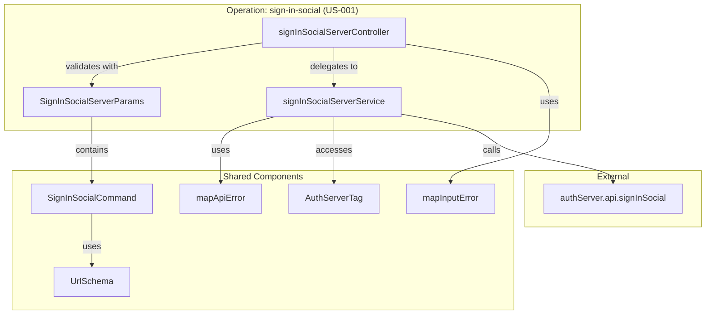
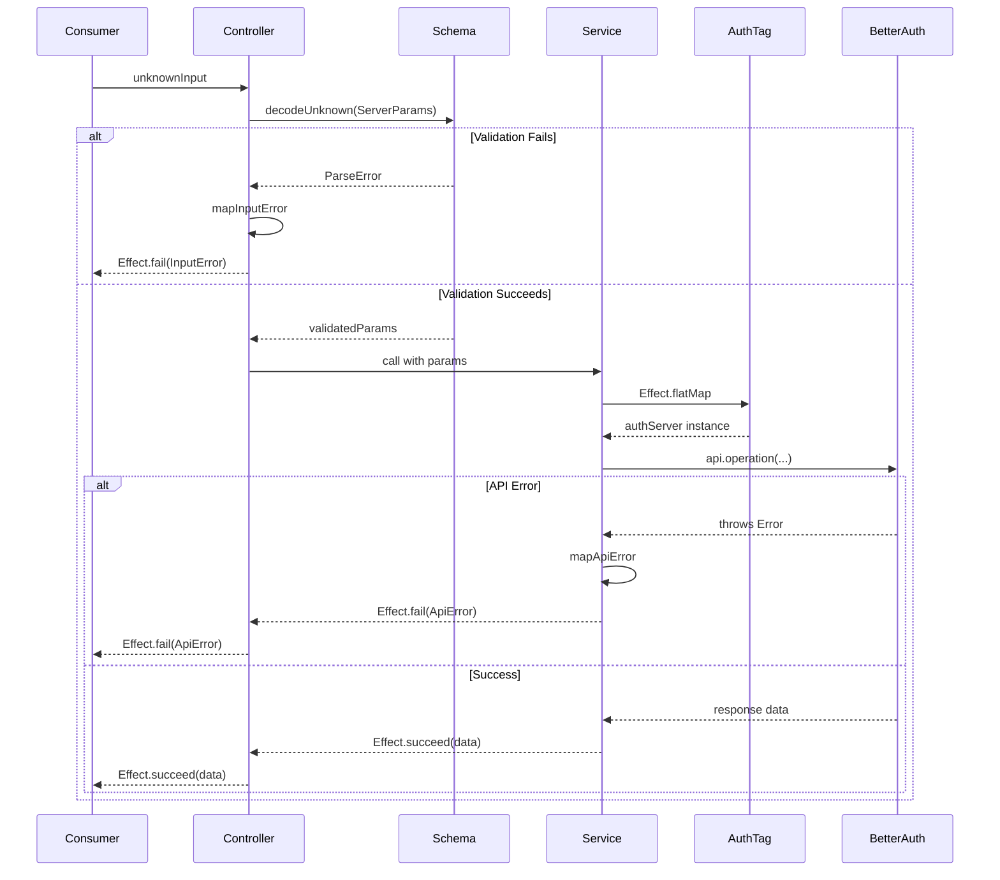
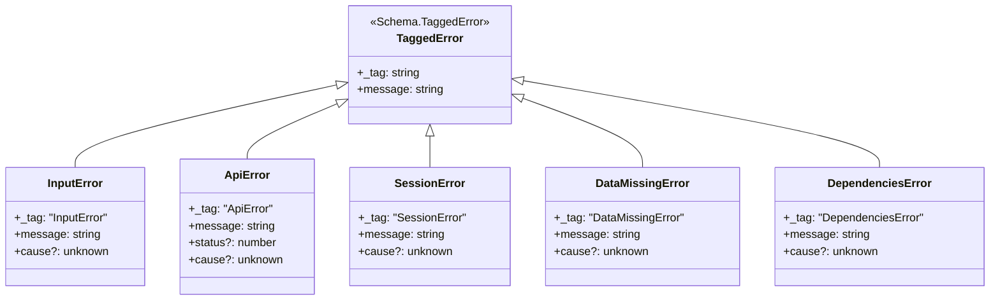
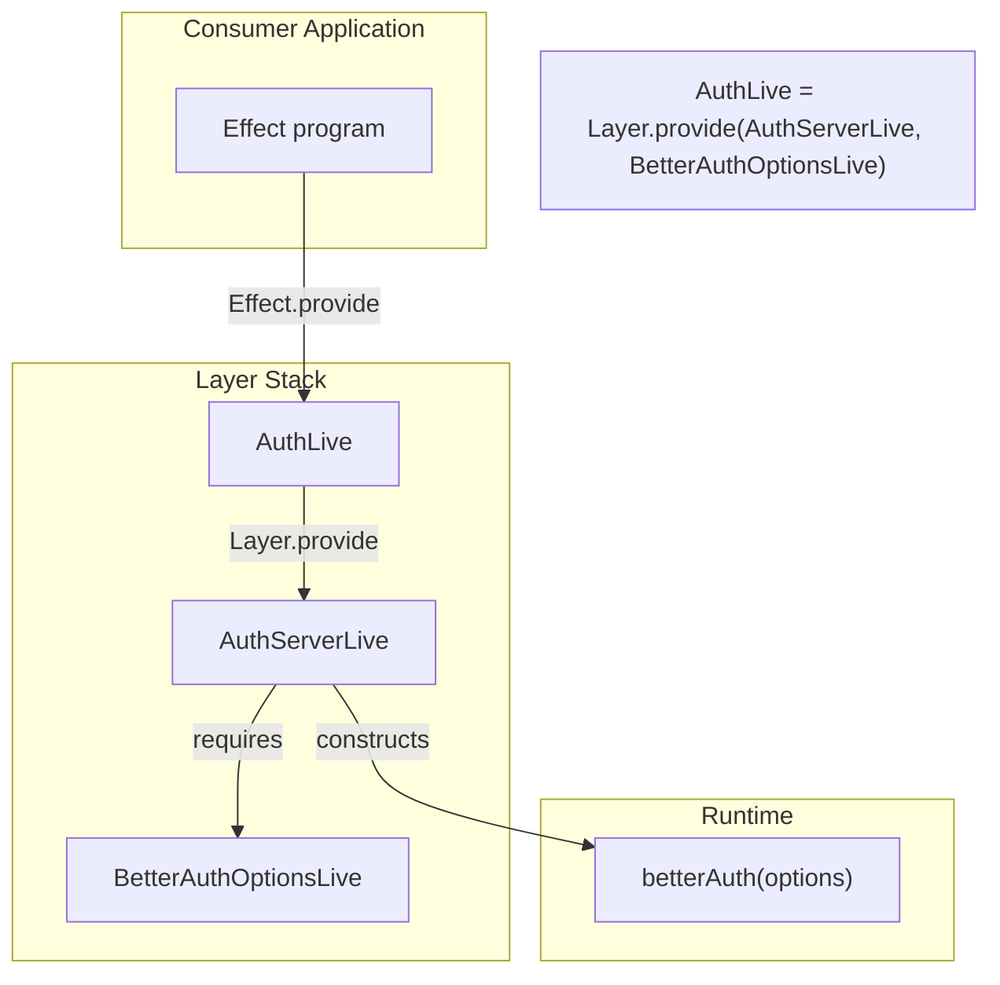

# Architecture Diagrams: Better Auth Utilities

## Overview

- **System Name**: Better Auth Utilities
- **Design Doc Reference**: [Technical Design Document](technical-design-doc.md)
- **Author**: Tech Lead
- **Last Updated**: 2026-01-03

---

## Context Diagram (Level 1)

Shows the system in context with external actors and systems.



### Context Narrative

The Better Auth Utilities library sits between the developer's application and the Better Auth SDK. It transforms the SDK's async/await API into Effect-TS patterns with:
- Schema-validated inputs (Effect Schema)
- Tagged error types (InputError, ApiError, SessionError, DataMissingError, DependenciesError)
- Context/Layer dependency injection (AuthServerTag, BetterAuthOptionsTag)

---

## Container Diagram (Level 2)

Shows the major structural elements within the library.



### Container Details

| Container | Technology | Purpose |
|-----------|------------|---------|
| Schema Layer | Effect Schema | Input validation, type safety, value objects |
| Controller Layer | Effect | Public API, orchestration |
| Service Layer | Effect | Better Auth API integration |
| Layer/Context | Effect Context | Dependency injection |
| Pipeline Utilities | Effect | Error transformation |
| Error Types | Schema.TaggedError | Typed error contracts |

---

## Component Diagram (Level 3)

Shows components within the server operation layer.



---

## Operation Component Diagram

Shows internal structure of a single operation (pattern for all 16).



---

## Data Flow Diagram

Shows the flow of data through an operation.



---

## Error Hierarchy Diagram



---

## Layer Composition Diagram



---

## File Structure Diagram

```
src/lib/
├── configs/                          # Configuration schemas
├── errors/                           # Tagged error types
│   ├── api.error.ts
│   ├── input.error.ts
│   ├── session.error.ts
│   ├── data-missing.error.ts
│   └── dependencies.error.ts
├── pipeline/                         # Error mapping utilities
│   ├── map-input-error/
│   ├── map-api-error/
│   ├── handle-input-error/
│   └── handle-api-error/
├── schema/
│   ├── commands/                     # Command schemas (16 pending)
│   ├── urls/                         # UrlSchema
│   ├── names/                        # NameSchema
│   ├── images/                       # ImageSchema
│   └── passwords/                    # PasswordSchema
└── server/
    ├── server.layer.ts               # AuthServerTag, AuthServerLive, AuthLive
    └── core/
        ├── email/                    # ✅ Complete (reference)
        ├── oauth/                    # í´µ E-001: To Implement
        │   ├── sign-in-social/       # US-001
        │   ├── callback-oauth/       # US-002
        │   ├── link-social-account/  # US-003
        │   └── index.ts
        ├── session/                  # í´µ E-002: To Implement
        │   ├── get-session/          # US-004
        │   ├── list-sessions/        # US-005
        │   ├── refresh-token/        # US-006
        │   ├── get-access-token/     # US-007
        │   ├── revoke-session/       # US-008
        │   ├── revoke-sessions/      # US-009
        │   ├── revoke-other-sessions/# US-010
        │   └── index.ts
        ├── account/                  # í´µ E-003: To Implement
        │   ├── account-info/         # US-011
        │   ├── list-user-accounts/   # US-012
        │   ├── unlink-account/       # US-013
        │   └── index.ts
        └── user/                     # í´µ E-004: To Implement
            ├── update-user/          # US-014
            ├── delete-user/          # US-015
            ├── delete-user-callback/ # US-016
            └── index.ts
```

---

## Legend

| Symbol | Meaning |
|--------|---------|
| ✅ | Complete/Implemented |
| í´µ | To be implemented (Phase 1) |
| ⬜ | Future phase |
| `Schema.TaggedClass` | Effect Schema validated class |
| `Schema.TaggedError` | Effect Schema error with _tag |
| `Schema.instanceOf(Headers)` | Native Headers object validation |
| `Context.Tag` | Effect dependency injection tag |
| `Layer.effect` | Effect layer construction |

---

## Traceability

| Epic | Operations | User Stories |
|------|------------|--------------|
| E-001 | OAuth | US-001, US-002, US-003 |
| E-002 | Session | US-004, US-005, US-006, US-007, US-008, US-009, US-010 |
| E-003 | Account | US-011, US-012, US-013 |
| E-004 | User | US-014, US-015, US-016 |

---

## Notes

### Key Design Decisions Reflected

1. **Controller-Service Separation**: Each operation has distinct controller (validation) and service (API) components - see [ADR-001](adrs/adr-001-controller-service-architecture.md)
2. **Consistent Error Types**: Five tagged errors cover all failure modes
3. **Layer-Based DI**: AuthServerTag enables testable, composable architecture
4. **Domain Organization**: Operations grouped by auth domain (OAuth, Session, Account, User)
5. **Native Headers**: Uses `Schema.instanceOf(Headers)` for type-safe header passing

### Areas of Complexity

1. **OAuth Callback (US-002)**: Requires state validation and error handling
2. **Session Revocation (US-008, US-009, US-010)**: Multiple variants (single, all, others)
3. **Delete User (US-015)**: May require password confirmation

### Future Evolution

- Phase 2: Client-side operations will mirror server structure
- Phase 3: Session caching layer may add intermediary
- Phase 4: MFA operations will add new domain

---

## Change History

| Date | Version | Author | Changes |
|------|---------|--------|---------|
| 2026-01-03 | 1.0 | Tech Lead | Initial architecture diagrams aligned with codebase |
