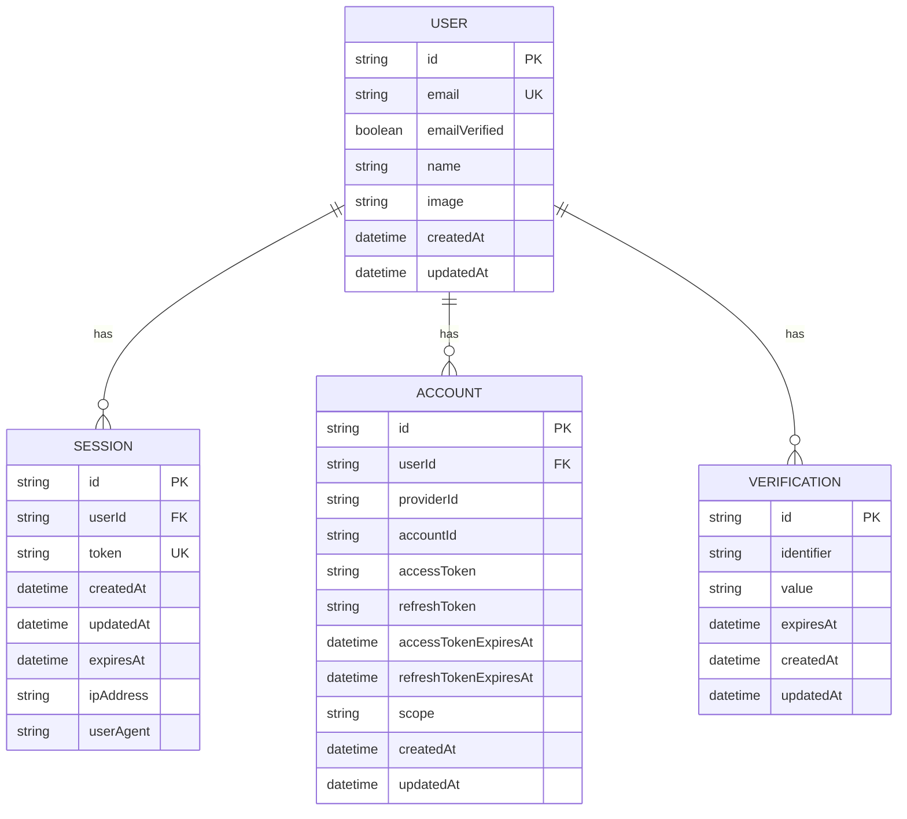

# Data Model: Better Auth Utilities

## Overview

- **Feature/Domain**: Better Auth Utilities Library
- **Database Technology**: Managed by Better Auth SDK (SQLite, PostgreSQL, MySQL)
- **Design Goals**: Document schema contracts for type-safe operations

---

## Important Note

The Better Auth Utilities library does **not** manage database schemas directly. All data persistence is handled by the Better Auth SDK. This document defines:

1. The data contracts that our Effect-TS wrappers interact with
2. The Effect Schema value objects used in command schemas
3. The relationship between library schemas and Better Auth entities

---

## Entity Relationship Diagram



---

## Better Auth Entities

### User

**Purpose**: Core user identity and profile information

**Table**: `user`

| Field | Type | Nullable | Default | Description |
|-------|------|----------|---------|-------------|
| `id` | string (CUID) | No | auto-generated | Primary key |
| `email` | string | No | - | User email (unique) |
| `emailVerified` | boolean | No | false | Email verification status |
| `name` | string | No | - | Display name |
| `image` | string | Yes | null | Profile image URL |
| `createdAt` | datetime | No | now() | Account creation time |
| `updatedAt` | datetime | No | now() | Last update time |

**Indexes**:
| Index Name | Fields | Type | Purpose |
|------------|--------|------|---------|
| `user_email_idx` | email | Unique | Email lookup |

---

### Session

**Purpose**: Active authentication sessions

**Table**: `session`

| Field | Type | Nullable | Default | Description |
|-------|------|----------|---------|-------------|
| `id` | string (CUID) | No | auto-generated | Primary key |
| `userId` | string | No | - | Foreign key to user |
| `token` | string | No | auto-generated | Session token (unique) |
| `createdAt` | datetime | No | now() | Session start |
| `updatedAt` | datetime | No | now() | Last activity |
| `expiresAt` | datetime | No | - | Expiration time |
| `ipAddress` | string | Yes | null | Client IP |
| `userAgent` | string | Yes | null | Browser/client info |

**Indexes**:
| Index Name | Fields | Type | Purpose |
|------------|--------|------|---------|
| `session_token_idx` | token | Unique | Token lookup |
| `session_user_idx` | userId | Index | User sessions list |
| `session_expires_idx` | expiresAt | Index | Cleanup queries |

**Constraints**:
- Foreign key: `userId` → `user.id` (CASCADE DELETE)

---

### Account

**Purpose**: Linked OAuth provider accounts

**Table**: `account`

| Field | Type | Nullable | Default | Description |
|-------|------|----------|---------|-------------|
| `id` | string (CUID) | No | auto-generated | Primary key |
| `userId` | string | No | - | Foreign key to user |
| `providerId` | string | No | - | OAuth provider (github, google) |
| `accountId` | string | No | - | Provider's user ID |
| `accessToken` | string | Yes | null | OAuth access token |
| `refreshToken` | string | Yes | null | OAuth refresh token |
| `accessTokenExpiresAt` | datetime | Yes | null | Token expiration |
| `refreshTokenExpiresAt` | datetime | Yes | null | Refresh expiration |
| `scope` | string | Yes | null | OAuth scopes granted |
| `createdAt` | datetime | No | now() | Link creation time |
| `updatedAt` | datetime | No | now() | Last update time |

**Indexes**:
| Index Name | Fields | Type | Purpose |
|------------|--------|------|---------|
| `account_user_idx` | userId | Index | User accounts list |
| `account_provider_idx` | providerId, accountId | Unique | Provider lookup |

**Constraints**:
- Foreign key: `userId` → `user.id` (CASCADE DELETE)
- Unique: `(providerId, accountId)` compound

---

### Verification

**Purpose**: Email verification and password reset tokens

**Table**: `verification`

| Field | Type | Nullable | Default | Description |
|-------|------|----------|---------|-------------|
| `id` | string (CUID) | No | auto-generated | Primary key |
| `identifier` | string | No | - | Email or user ID |
| `value` | string | No | - | Verification token |
| `expiresAt` | datetime | No | - | Token expiration |
| `createdAt` | datetime | No | now() | Creation time |
| `updatedAt` | datetime | No | now() | Last update |

---

## Relationships

| From | To | Type | Description |
|------|-----|------|-------------|
| User | Session | One-to-Many | User has multiple sessions |
| User | Account | One-to-Many | User has multiple linked providers |
| User | Verification | One-to-Many | User has pending verifications |

---

## Library Schema Definitions

### Value Object Schemas

Located in `src/lib/schema/`:

#### UrlSchema

```typescript
// src/lib/schema/urls/url.schema.ts
export class UrlSchema extends Schema.TaggedClass<UrlSchema>()(
  "UrlSchema",
  { value: Schema.String },
) {}
```

**Usage**: `callbackURL`, `errorCallbackURL`, `newUserCallbackURL`, `image` URLs

#### NameSchema

```typescript
// src/lib/schema/names/name.schema.ts
export class NameSchema extends Schema.TaggedClass<NameSchema>()(
  "NameSchema",
  { value: Schema.String },
) {}
```

**Usage**: User `name` field in `UpdateUserCommand`

#### ImageSchema

```typescript
// src/lib/schema/images/image.schema.ts
export class ImageSchema extends Schema.TaggedClass<ImageSchema>()(
  "ImageSchema",
  { value: Schema.String },
) {}
```

**Usage**: User `image` field in `UpdateUserCommand`

#### PasswordSchema

```typescript
// src/lib/schema/passwords/password.schema.ts
export const PasswordSchema = (config: { minLength: number; maxLength: number }) =>
  Schema.TaggedClass<PasswordSchema>()(
    "PasswordSchema",
    { value: Schema.String.pipe(Schema.minLength(config.minLength), Schema.maxLength(config.maxLength)) },
  );
```

**Usage**: `password` field in `DeleteUserCommand`

---

### Command Schemas

Located in `src/lib/schema/commands/`:

| Command | Domain | Body Fields | User Story |
|---------|--------|-------------|------------|
| `SignInSocialCommand` | OAuth | provider, callbackURL?, errorCallbackURL?, newUserCallbackURL?, disableRedirect? | US-001 |
| `CallbackOAuthCommand` | OAuth | state?, code?, error? | US-002 |
| `LinkSocialAccountCommand` | OAuth | provider, callbackURL? | US-003 |
| `GetSessionCommand` | Session | (empty) | US-004 |
| `ListSessionsCommand` | Session | (empty) | US-005 |
| `RefreshTokenCommand` | Session | (empty) | US-006 |
| `GetAccessTokenCommand` | Session | (empty) | US-007 |
| `RevokeSessionCommand` | Session | token?, id? | US-008 |
| `RevokeSessionsCommand` | Session | (empty) | US-009 |
| `RevokeOtherSessionsCommand` | Session | (empty) | US-010 |
| `AccountInfoCommand` | Account | (empty) | US-011 |
| `ListUserAccountsCommand` | Account | (empty) | US-012 |
| `UnlinkAccountCommand` | Account | providerId | US-013 |
| `UpdateUserCommand` | User | name?, image?, additionalFields? | US-014 |
| `DeleteUserCommand` | User | password?, callbackURL? | US-015 |
| `DeleteUserCallbackCommand` | User | token | US-016 |

---

### ServerParams Schemas

Located in `src/lib/server/core/{domain}/{operation}/{operation}.types.ts`:

```typescript
// Pattern for all 16 operations
export class {Operation}ServerParams extends Schema.TaggedClass<{Operation}ServerParams>()(
  "{Operation}ServerParams",
  {
    body: {Operation}Command,
    headers: Schema.optional(Schema.instanceOf(Headers)),
    asResponse: Schema.optional(Schema.Boolean),
    returnHeaders: Schema.optional(Schema.Boolean),
  },
) {
  static decode(input: unknown) {
    return pipe(input, Schema.decodeUnknown({Operation}ServerParams));
  }

  static encode(value: {Operation}ServerParams) {
    return pipe(value, Schema.encode({Operation}ServerParams));
  }
}
```

---

## Access Patterns

| Pattern | Query Approach | Used By |
|---------|----------------|---------|
| Get user by email | `WHERE email = ?` | signUpEmail, signInEmail |
| Get session by token | `WHERE token = ?` | getSession |
| List user sessions | `WHERE userId = ?` | listSessions |
| Get account by provider | `WHERE providerId = ? AND accountId = ?` | callbackOAuth |
| List user accounts | `WHERE userId = ?` | listUserAccounts, accountInfo |
| Revoke session | `DELETE WHERE token = ?` | revokeSession |
| Revoke all sessions | `DELETE WHERE userId = ?` | revokeSessions |
| Unlink account | `DELETE WHERE userId = ? AND providerId = ?` | unlinkAccount |

---

## Migration Notes

### Better Auth Migration Responsibility

- Schema migrations are managed by Better Auth SDK
- Consumers configure database adapter in `BetterAuthOptions`
- Better Auth auto-migrates on first run (configurable)

### Library Compatibility

| Better Auth Schema Version | Library Version | Notes |
|---------------------------|-----------------|-------|
| v1.0 | 1.0.x | Initial support |
| v1.1 | 1.0.x | Backward compatible |
| v2.0 | TBD | May require schema updates |

### Rollback Approach

Not applicable - library does not manage database schemas.

---

## Traceability

| Epic | Domain | Entities Affected |
|------|--------|-------------------|
| E-001 | OAuth | User, Session, Account |
| E-002 | Session | Session |
| E-003 | Account | Account |
| E-004 | User | User |

---

## Change History

| Date | Version | Author | Changes |
|------|---------|--------|---------|
| 2026-01-03 | 1.0 | Backend Engineer | Initial data model aligned with codebase schemas |
